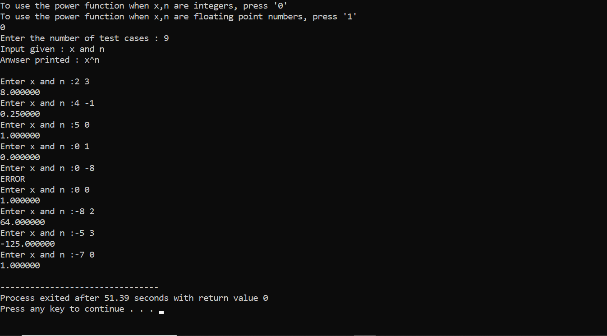

# Implementation of pow() function in C

To calculate x^n, considering two cases
-	`intPower(x, n)`
	- x and n, both are of `int` data type

- `floatPower(x, n)`
	- x and n, both are of `float` data type - 

## Assumptions

- The intPower and floatPower functions only work when x^n doesn't cross the range of double type
- The intPower and floatPower functions return INT_MAX (indicating error), when ans=0^(-ve number) or ans=(-ve number)^(non-integer number). Hence both the functions fail only at the case x=INT_MAX and n=1
- The floatPower function takes all floating point numbers of x, n except the range ( (-inf < x < 0) and (n is not an integer) )

## Screen Shots
### Case1 - x,n are ints

### Case2 - x,n are floats

## Video Explanation
https://drive.google.com/file/d/1PXtM0ohIFcnaLFxTWiXy2XX9HfDZT0Pf/view?usp=sharing